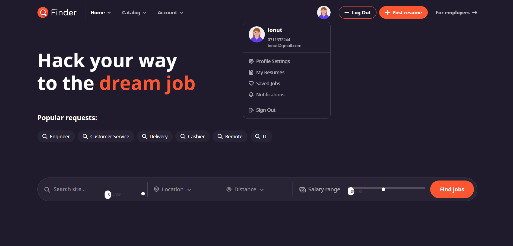
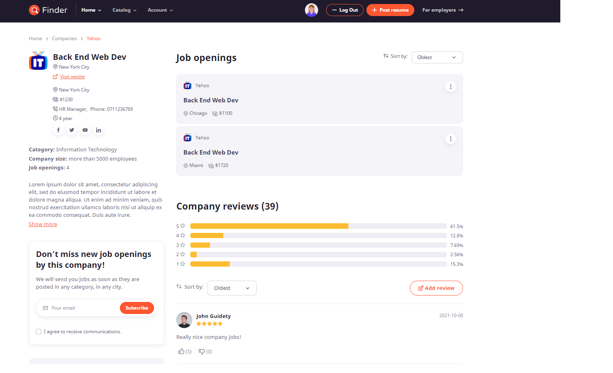
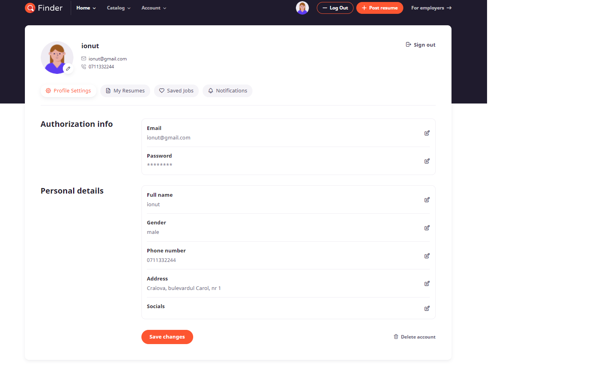
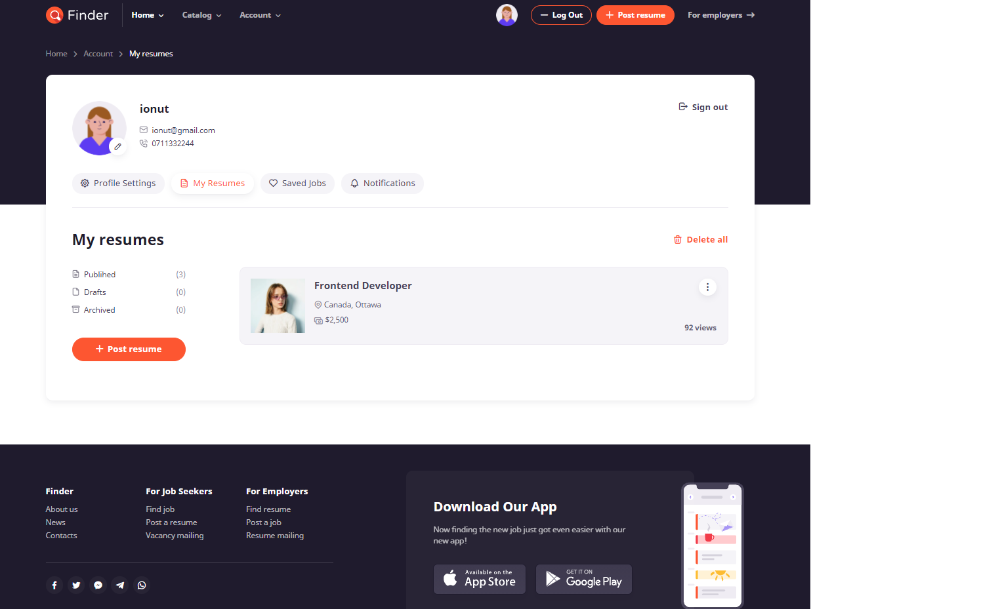
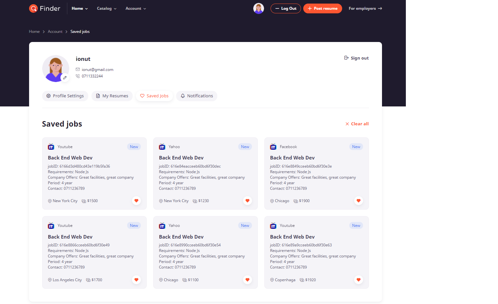
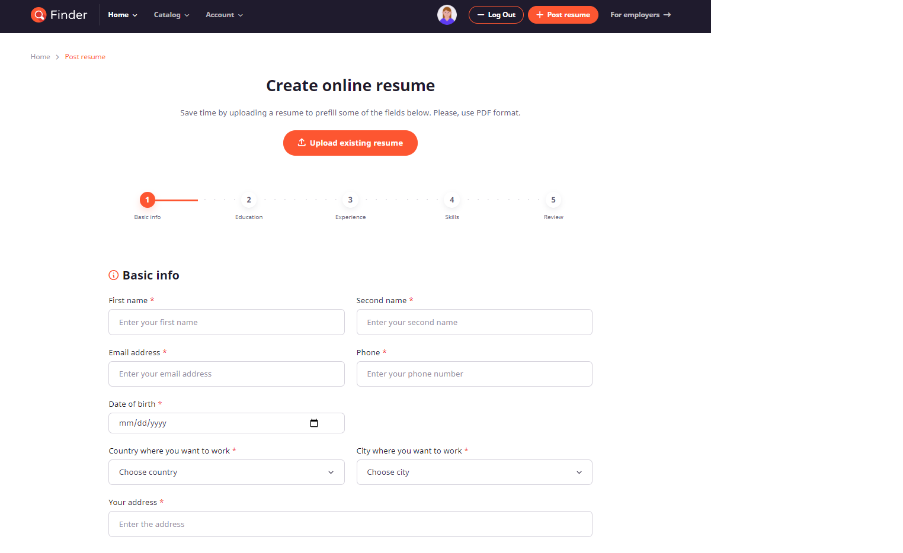
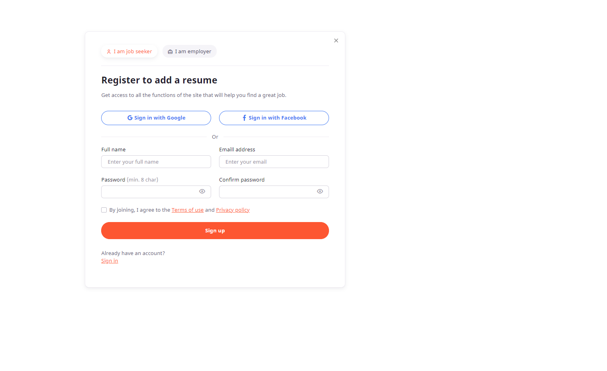

### comment 
# Job Finder - Online Job Finder Application developed in React.js and Node.js.

Online teaching application in which the user can view online courses, rate the course and leave a review.Users can also become instructors, meaning that any user can add his own course to the application. Users can also manage their own profile, editing their credentials. They can also bookmark courses or enroll into the ones they desire.

## Available Scripts

In the project directory, you can run:

### `1. npm install`

Install all required dependencies.

### `2. You need to download the server application and run it`

### `3. npm start`

Runs the app.
Open [http://localhost:3000](http://localhost:3000) to view it in the browser.

## Print-Screens

