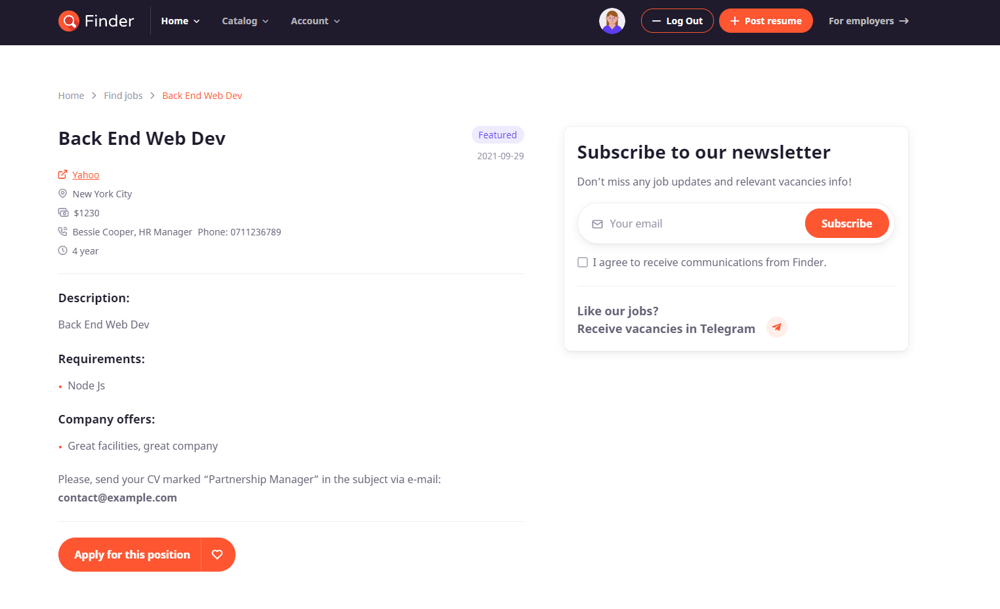

 
# Job Finder - Online Job Finder Application developed in React.js and Node.js.

Online job finder application in which the user can view the job list, rate the job and leave a review.Users can also become employers, meaning that any user can add his own resume to the application. Users can also manage their own profile, editing their credentials. They can also save the preffered jobs and resumes.

## Available Scripts

In the project directory, you can run:

### `1. npm install`

Install all required dependencies.

### `2. You need to download the server application and run it`

### `3. npm start`

Runs the app.
Open [http://localhost:3000](http://localhost:3000) to view it in the browser.

## Print-Screens

